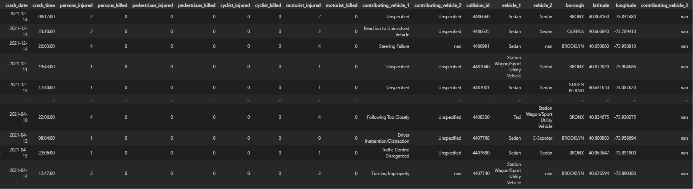
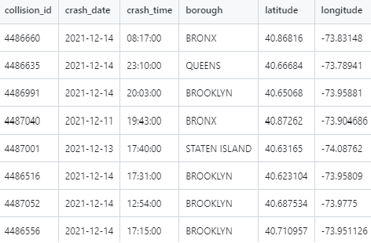
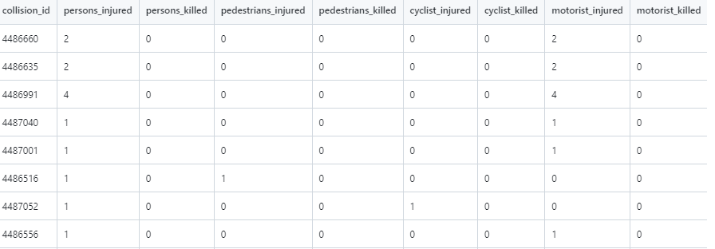
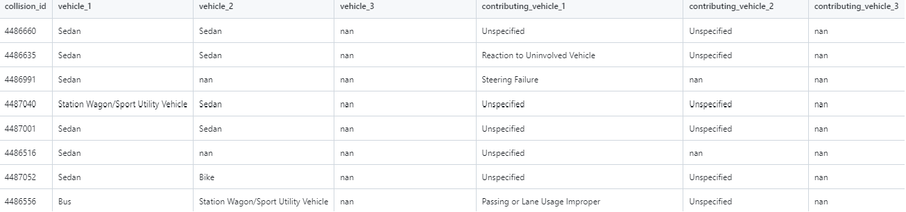
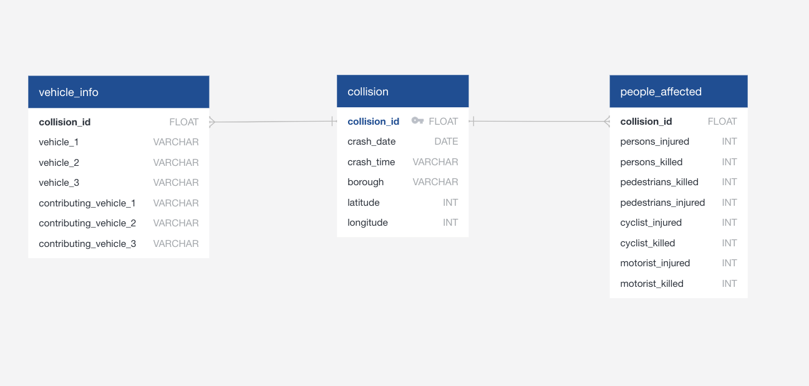

# Project 3: Using ETL Method to create a New York vehicle collision records datatbase.

## An overview of the project and its purpose
This project follows data engineering proccesses and uses an ETL workflow to transmit data from the NYPD on car collisons.
First we extrated the data from API endpoint provided by NYC Open Data.

[Webpage](https://data.cityofnewyork.us/Public-Safety/Motor-Vehicle-Collisions-Crashes/h9gi-nx95/about_data) 

[JSON](https://data.cityofnewyork.us/resource/h9gi-nx95.json)

## Cleaning Process
The API was read into a python file using response request from the Pandas Library.

After being read in the data was cleaned and organized in the following manor.

1. Coloumns not applicable for our analysis were dropped using:
<code>columns_dropped_df=df.drop(['on_street_name','off_street_name', axis=1) </code>

2.Coloumns were renamed for simplicity.

3.Cells with NA values in the latitude, longitude and borough columns were dropped, so that only data with a full scope of location were kept.
<code> clean_data = columns_dropped_df.dropna(subset=['borough'] + ['latitude']+ ['longitude'])
clean_data</code>

4. Columns were renamed for simplicty, date and time columns were converterted to datetime format,
 finally column values with integers were converted to float64 and then remaining columns were converted to object(string)

5. Lastly rows with all zero values(in regard to injury or death) were removed, since no person, motrist, or cyclist was injured we dropped the data to keep just incidents with injuries.

   
<code>columns_to_check = ['persons_injured', 'persons_killed','pedestrians_injured', 'pedestrians_killed', 'cyclist_injured', 'cyclist_killed', 'motorist_injured', 'motorist_killed']</code>

<code>mask = (vehicle_data[columns_to_check] == 0).all(axis=1)</code>

<code>vehicle_data_filtered = vehicle_data[~mask]</code>

## The clean data table

## Three seperate CSV's were created to load into our SQL database

Collisions CSV

People affected CSV

Vehicle info CSV

## Database creation
In this section, we used the cleaned csv files from the above sections to create a Postgresql Database. 

First, an  was created to visualize the relationships between the entities, and allow easy creation of our schema.sql

This SQL file was uploaded into the Database. The CSV files were imported into the schema, and the database was queried with SELECT statements.

 .

## Instructions on how to use and interact with the project
To interact and use this database follow the steps.
1. upload the query.sql file to postgreSQL
2. after the tables are created upload the corresponding CSV's to populate them
3. Perform queries to obtain specific results.
4. The queried results can be exported as CSV files and used to create visualizations using libraries like pandas or seaborn (histograms, piecharts etc.)
5. Below are some examples of our queried results and visulazitions

Queries

 .

## At least one paragraph summarizing efforts for ethical considerations made in the project

Looking at ethical considerations, several factors need to be taken into account. Firstly, the data under examination is sourced exclusively from the NYPD, indicating that only reported collisions were tracked. It is crucial to acknowledge the limitation that not all collisions are included in this dataset. It is reasonable to assume that collisions involving individuals without insurance or those in a lower socioeconomic status may not have been reported.

Given the nature of this dataset, there arises an intriguing avenue for research—tracking the journey of individuals who sustained injuries in these collisions. However, to delve into this aspect, participants would be required to provide consent for the release of their medical information in accordance with the Health Insurance Portability and Accountability Act (HIPAA). If such approvals were obtained, a more in-depth analysis of the injury data associated with vehicle collisions could have been conducted.

## References for the data source(s)

[Webpage](https://data.cityofnewyork.us/Public-Safety/Motor-Vehicle-Collisions-Crashes/h9gi-nx95/about_data) 

[JSON](https://data.cityofnewyork.us/resource/h9gi-nx95.json)

